## _Tutoriel : Comment créer de la fumée sur SparkAR_

### Introduction

Ce tutoriel a été créé dans le cadre du [2020 Developer Circles Community Challenge](https://developercircles2020.devpost.com/) organisé par Facebook et Devpost.

Nous allons couvrir une méthode pour obtenir un shader de type fumée à appliquer sur tout objet dans vos scènes grâce au [Render Pass](https://sparkar.facebook.com/ar-studio/learn/patch-editor/render-passes/render-passes-overview#limitation) , une capacité assez récente de Spark AR, ainsi qu'un patch de la librairie d'assets que nous modifierons légèrement.

_Voici ce que nous allons construire :_

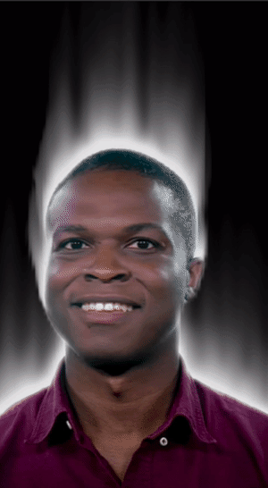

### Avant de commencer

Ce dont vous aurez besoin pour suivre ce tutoriel :
1. Spark AR installé sur votre machine, version 90+ (la version la plus à jour peut être téléchargée ici : [SparkAR](https://sparkar.facebook.com/ar-studio/download/))
2. Une texture de type "noise" soit du bruit visuel [(vous en trouverez une dans le folder downloads de ce projet)](./downloads/noise.jpg)

C'est tout! :)

### 1ère partie - _Préparation_

L'idée derrière ce projet est de créer une "feedback loop" -ou boucle- grâce au Render Pass, sur laquelle nous appliquerons une distortion à chaque passages successifs. Nous allons baser cette boucle sur des Delay Frame -des frames gelés et retardés- en les modifiant à chaque passage dans la boucle. Chaque itération affectera l'image, ce qui résultera dans un look fluide et continu.

La première chose que l'on va faire c'est déjà ouvrir le programme, Spark AR et créer un nouveau projet vide. De là, nous allons importer quelques patchs et brièvement expliquer pourquoi.
Commencons par insérer le patch pour l'input de notre Device.

Gardez bien en tête que ceci restera quoi qu'il arrive la fin de notre chaîne, c'est le patch qui déterminera ce qui s'affiche à l'écran.
Nous allons donc importer le Delay Frame ainsi qu'un Receiver, que vous pouvez déjà lui assigner. Finalement, dans cette première phase de l'effet, nous allons vouloir rendre l'utilisateur fumant, soit nous allons utiliser la segmentation de personne afin de créer la base de la fumée. Pour ce faire, sélectionnez votre caméra dans l'inspecteur de scène et importez les deux textures :

Vous verrez maintenant dans votre panneau d'assets deux nouvelles textures : cameraTexture0 et personSegmentationMaskTexture0, clickez et restez appuyé pour les tirer dans votre éditeur de patch (View > Show/Hide Patch Editor si ce dernier n'est pas encore ouvert).

Voici les pré-requis pour commencer, passons à la suite!

### 2ème partie - _Création de la boucle_

L'idée est donc de modifier un delay frame. Pour y arriver, nous allons utiliser un patch Texture Transform, en tandem avec un patch 2D Transform. Ces derniers nous permettrons de modifier le frame retardé chaque fois qu'il passe à travers. Au vu de notre utilisation de Render Pass, nous ne pouvons pas connecter cette texture directement au Delay Frame, nous devons importer un Shader Render Pass qui servira d'intermédiaire, comme suit :

Que mettre maintenant comme Texture je vous entends demander?
On pourrait directement connecter le delay frame comme texture en utilisant le Receiver importé plus tôt, cependant nous voulons que notre effet s'applique uniquement à l'utilisateur, pas à l'entièreté du canevas. Ceci veut en fait dire que nous ne voulons affecter que le fond de l'image, et rien de la personne devant. Nous allons donc devoir utiliser un patch "Blend" afin de mélanger d'une partie la segmentation du fond -créée en utilisant les deux textures importées et en les connectant à l'aide d'un patch Pack, vec2- avec le canevas, soit le delay frame.

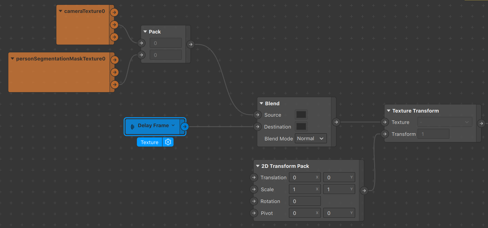

A ce stade nous pouvons aussi connecter la sortie ou l'output du Blend à l'entrée/input du patch Device afin d'avoir nos premiers résultats visuels. Il est possible de changer la couleur de fond en modifiant l'input Color du Delay Frame. C'est également à ce stade que nous remarquons bien la "loop" présente, qui débute lorsqu'un frame rentre dans le patch Blend. De là il sera transformé, passera dans le Shader Render Pass et sera ensuite renvoyé en tant que frame retardé grâce au Receiver, pour retourner dans le Blend et continuer son cycle à l'infini.

Il suffit maintenant de modifier quelques valeurs dans le patch 2D Transform Pack afin d'avoir des résultats plus intéressants. En changeant l'attribut "Scale" (échelle) notamment, même par 0,01, on fera bouger chaque frame retardé dans une direction. Nous souhaitons pour le moment centrer les transformations, donc changeons les Pivots X et Y à 0,5 (cette valeur est relative aux dimensions de l'écran). Vous pouvez à ce stade jouer et obtenir de nombreux résultats assez intéressants! Petit bonus, afin de dynamiser votre effet, utilisez la position du visage (soit celle d'un face tracker de votre scène pour directement influencer certaines valeurs).

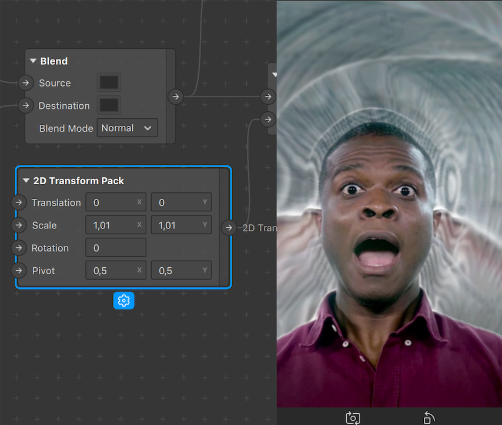

Voici fondamentalement ce qui fait notre effet de fumée, d'ici nous allons implémenter de la distoriton visuelle, afin de modifier chaque frame un petit peu plus à chaque itération de la boucle et en fonction de la distortion précédente. 

### 3ème partie - _Texture Distortion Shader_

Afin d'implémenter notre distortion, nous aurons besoin de deux choses :
1. [la texture "noise"](./downloads/noise.jpg)
2. Le patch Texture Distortion Shader de la libraire d'assets in-built de Spark AR :

La texture que nous allons utiliser ici est celle du folder downloads de ce projet github. Téléchargez l'image et importez la dans le panneau d'assets de Spark AR. Ensuite, naviguez vers la librairie d'assets de Spark AR et, dans la barre de recherche, cherchez le patch de distortion. Une fois trouvé, importez le dans votre projet et mettez le dans votre éditeur de patch. Nous allons l'utiliser pour connecter le Receiver à gauche et le Blend patch à droite (remplaçeant la connection directe entre le Receiver et le Blend).

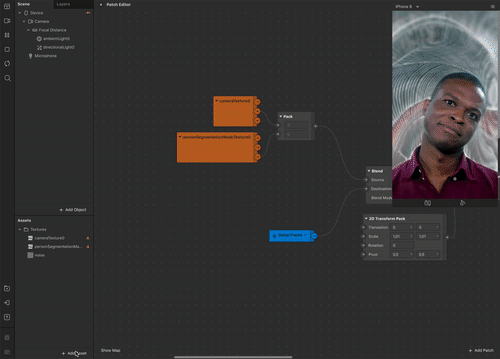
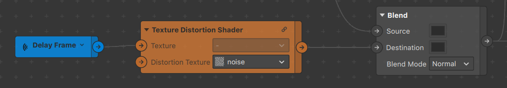

Ce patch utilise en fait une texture en noir et blanc afin de distordre une autre texture. Il est utile comme tel, mais nous allons l'ajuster quelque peu pour le rendre plus flexible. Nous allons exposer une valeur pour controler la force de la distortion (elle est en fait déjà présente mais non visible/exposée par défaut) et une autre afin de controler la direction (par défaut la distortion est diagonale, d'en haut à gauche vers le bas à droite).

Clickez sur "Expand" ou l'icône de chaîne sur le patch afin d'entrer dedans. Vous y trouverez un patch Multiply au début sur lequel nous allons clicker le second input. Ceci ouvrira un menu contextuel qui nous permettra de créer un patch d'entrée que l'on pourra utiliser directement un niveau plus haut.

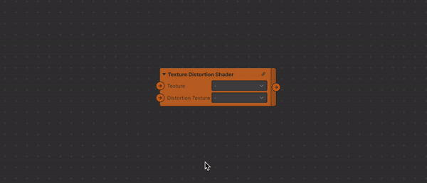

Ceci sera le paramètre de force. Renommez-le si nécessaire et assignez-y des valeurs aléatoires et contraintes en clickant sur l'icône d'écrou et en sélectionnat "Edit Properties"

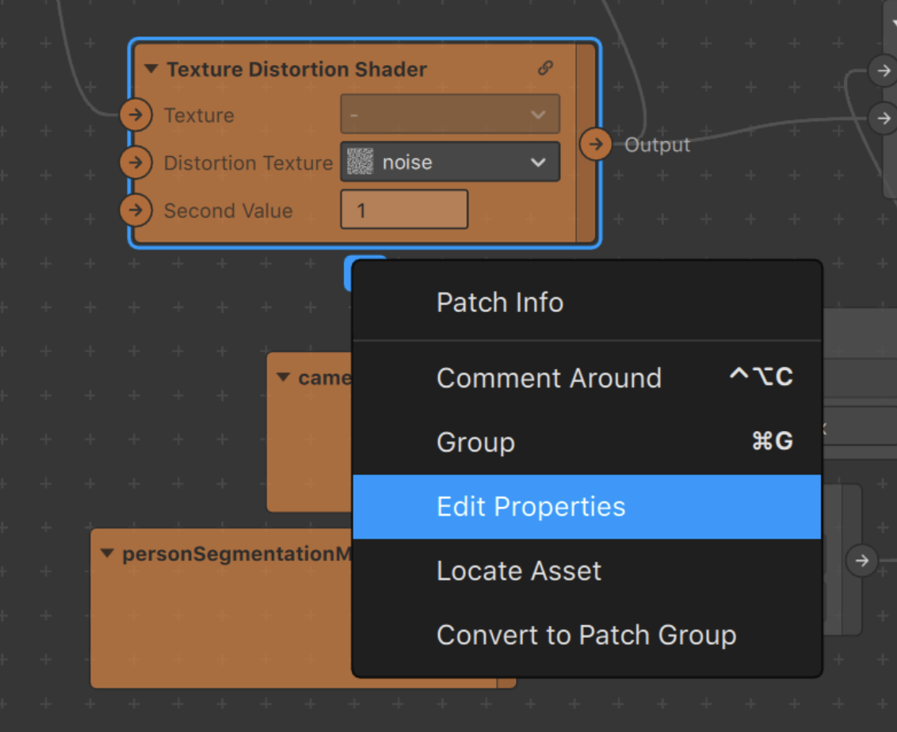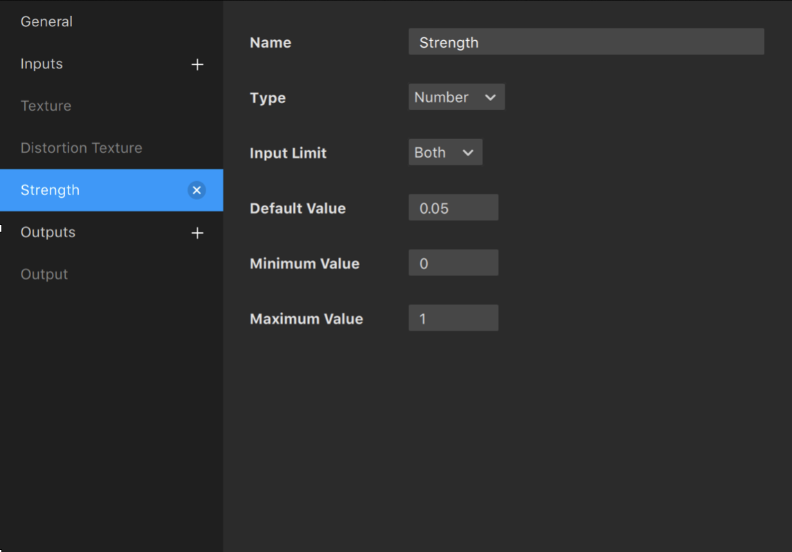

Ce paramètre de force affecte la luminosité de la texture de distortion, donc une valeur en dessous de 1 la rendra plus sombre, et une valeur supérieure à 1 l'éclaircira. La luminosité des pixels de la texture de distortion est utilisée pour déterminer la distance de déplacement de chaque pixel de la texture principale. 

_Les photos ci-dessous utilisent une version plus finale de l'effet afin de comprendre plus facilement ce qu'il se passe_

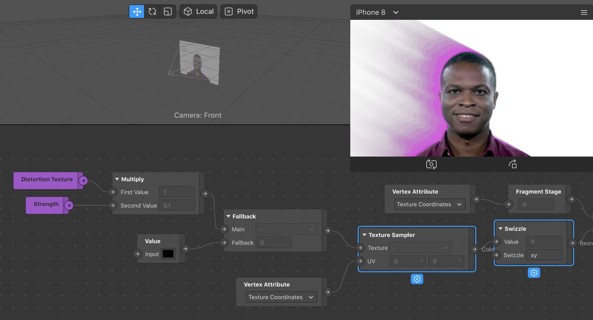

La texture de distortion sera analysée et recomposée -swizzled- en un vecteur 2. Ceci étant une image noire et blanche, les valeurs x et y sont les mêmes, ce qui veut dire que la distortion sera toujours dans une direction en diagonale (ex : un pixel à droite, un pixel vers le bas). Nous pouvons cependant contrôler la direction de cette diagonal en multipliant le vecteur avec un autre vecteur de type 2 (vec2).

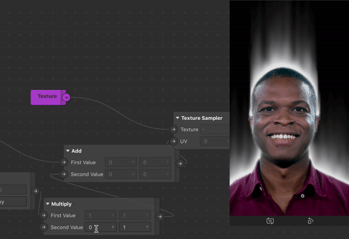

Nous pouvons maintenant exposer cette valeur comme paramètre nommé direction. Le nouveau patch amélioré devrait ressembler à ceci :

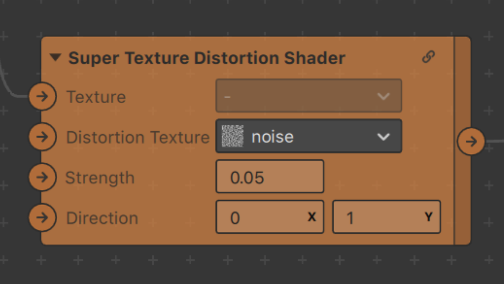

### 4ème partie - _Et la fumée dans tout ça?_

Revenons maintenons aux résultats actuels, voici ce que vous devriez voir dans votre simulateur si vous avez suivi jusqu'ici et fixé la force à 0,02 ainsi que la direction à (0,1).

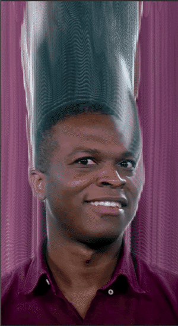

Nous avons donc un mouvement fluide qui se propage vers le haut. Ceci n'est pas encore de la fumée, non seulement en terme de couleur, mais en terme de limites. L'implémentation actuelle ne s'arrête pas et se propage jusqu'aux bords de l'écran.

Nous allons attaquer la problématique de la portée en premier. Une manière simple d'y parvenir est d'ajouter un patch Multiply entre le Receiver et notre nouveau Super Texture Distortion Shader. Le receiver transmettant une texture, nous pouvons en affecter l'opacité grossièrement en changeant le multiplicateur par toute valeur en-dessous de 1.

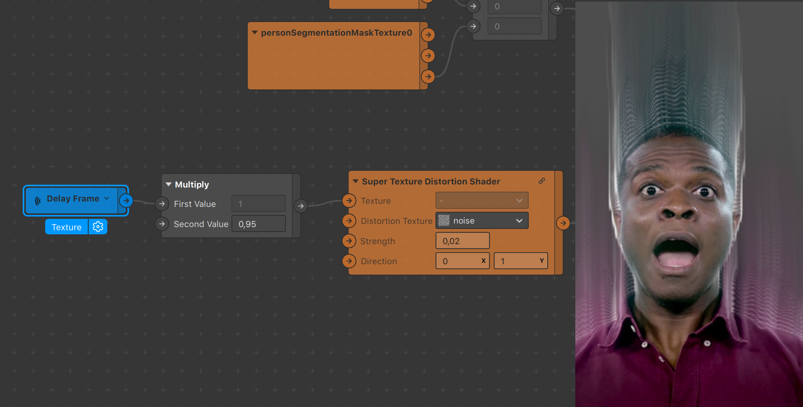

Maintenant que la fumée est restreinte, adressons nous brièvement au fond d'écran afin de la rendre plus visible. Cela aidera la fumée à ressortir visuellement et donc nous permettra de mieux voir nos résultats et l'impact de nos changements.

Rajouter un patch Blend entre le nouveau Multiply et le patch custom de distortion :

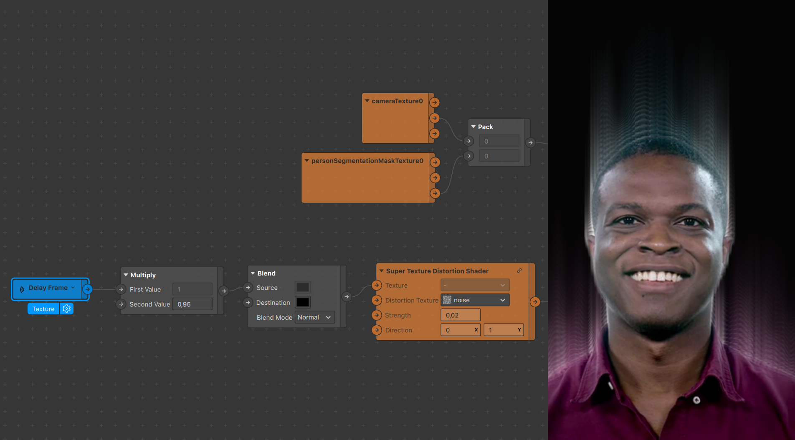

A ce stade nous pouvons enfin changer la couleur du fond, ce qui jusqu'ici n'était pas possible sans rajouter ou modifier quelques éléments.

Maintenant que la couleur de fond n'est plus un problème attaquons-nous à la couleur de la fumée, idéalement blanche donc. L'atout ici est de repenser à ce qui est initialement mis dans notre boucle. Nous utilisons actuellement la segmentation en combinaison avec la texture générée par la caméra, ce qui applique bien l'effet à la personne, cependant projette la texture de la caméra dans la boucle. Nous souhaitons dorénavant n'utiliser que la segmentation, qui consiste en une texture blanche et transparente, parfaite à distordre pour nos besoins! Connectez donc directement la châine Alpha du patch personSegmentation.

Ensuite remonter le patch Blend connecté au Device et ajouter un autre patch Blend en-dessous. Ce nouveau patch sera celui qui prendra la sortie Alpha mentionnée comme Source. Etant donné qu'on veut entrer cette texture dans la loop, nous connecterons également notre Super Texture Distortion Shader comme input Destination. De cette manière l'Alpha sera lancée dans la chaîne, puis dans le delay frame, sera ensuite distordue, re-passera par le delay etc...

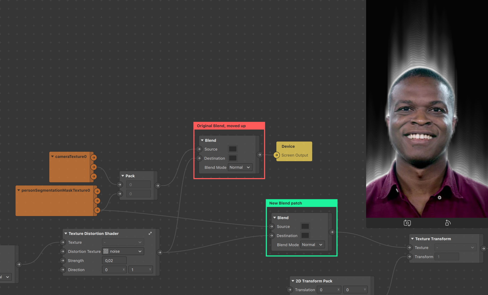

Finalement nous pouvons affiner nos résultats en retouchant légèrement la segmentation de la personne avant de la connecter au reste. Un rapide import du patch Swizzle, que l'on fixera à 111x, nous permettra d'utiliser la chaîne Alpha sans se soucier des changements RGB. (une texture est généralement composée des quatres châines RGBA).

Ceci nous amène à la fin du setup initial, et donc à un Dolapo fumant! L'effet peut d'ici être appliqué à de nombreux différents objets ainsi qu'être modifié et affiné pour obtenir des résultats très différents. Nous allons ci-dessous couvrir comment l'appliquer à d'autres éléments de la scène.

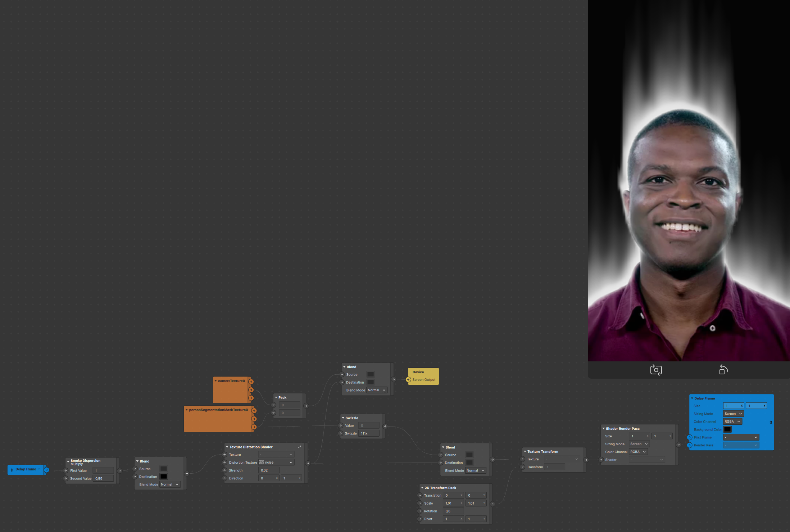

### 5ème partie - _Comment l'appliquer à d'autres éléments de scène?_

L'emploi le plus commun que l'on spécule pour ce genre de shader est l'application sur des objets 3D. Afin d'y parvenir, importons un objet dans notre scène. Pour ce tutoriel nous utiliserons simplement le logo de Spark AR trouvé dans la libraire d'assets sous le nom Spark Primitive. Mettez-le dans la scène.

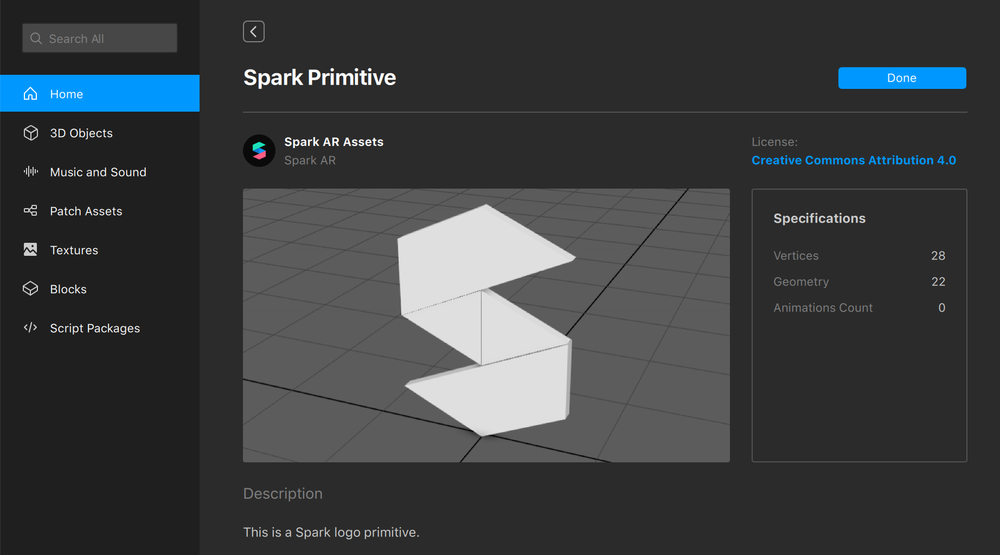

A nouveau il est important de comprendre pourquoi nous procédons ainsi, donc arrêtons-nous deux secondes pour être aussi clair que possible.

Souvenez-vous que nous avons depuis le début appliquer notre effet à l'utilitaseur, ce qui nous a mené a utiliser la segmentation de la personne. Ceci n'est plus le cas, étant donné que notre fumée doit être générée à partir de l'objet 3D. Il y a deux choses à prendre en compte :
1. Ce que nous voulons distordre
2. Ce que nous voulons qui soit "rendu" visuellement à l'avant de la scène

Adresser le premier point est assez simple, puisque nous voulons utiliser l'objet 3d pour générer la fumée, il suffit de connecter notre objet 3d comme image de base à être retardée et distordue dans la boucle. Afin d'y parvenir cependant, et à nouveau en vertu de notre emploi du Render Pass, nous aurons à nouveau besoin d'un patch lié, le Scene Render Pass. Ce patch nous permettra de dire au programme qu'il doit faire un rendu de cet objet à l'écran.

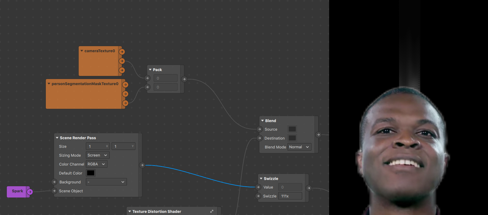

Nous pouvons constater que la fumée est bien créée à partir de l'objet 3d en observant notre simulateur. Cependant le devant de la scène est toujours occupé par la segmentation de la personne, ce qui cache partiellement la fumée. De plus notre objet 3D n'est toujours pas visible. Nous devons donc remplacer la segmentation de l'utilisateur avec un rendu de l'objet 3D, provenant du Scene Render Pass.

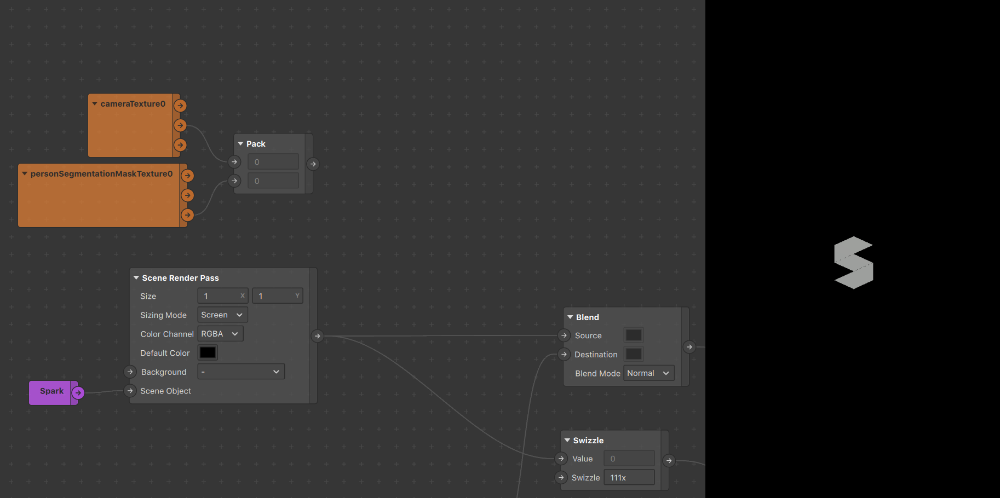

Maintenant que l'on voit notre objet 3D, la fumée a disparue, un peu perturbant... Ceci est simplement dû à la manière dont marche le Scene Render Pass, qui possède lui aussi un attribut Color, noir par défaut. Cette couleur est malheureusement prise en compte dans le délay frame et couvre la fumée que l'on a construite. Heureusement ceci est simple à remédier, il suffit de changer la couleur du noir opaque à n'importe quoi mais tout à fait transparent (opacité 0%). La fumée devrait apparaître!

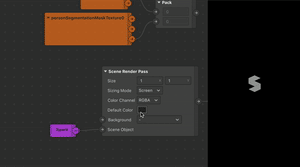

Voilà comment l'appliquer à n'importe quel objet de la scène! Une touche finale ici serait de rendre le vrai fond de la caméra visible, un fond noir n'étant en vrai pas très intéressant ni utile. Il y a plusieurs manières de faire mais nous allons ici réutiliser le patch Blend à gauche du Super Texture Distortion Shader. Ce dernier se placera juste à droite cette fois du patch de distortion afin de ne pas faire entrer la cameraTexture dans la boucle et donc éviter qu'elle ne soit distordue. 

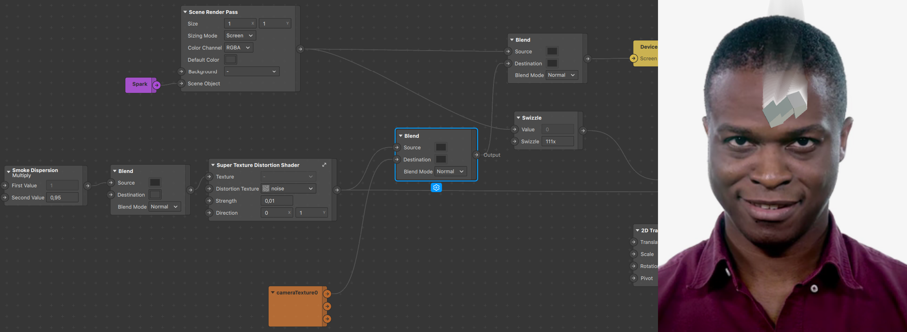

_Cet effet peut notamment s'appliquer sur des particules de la même manière_

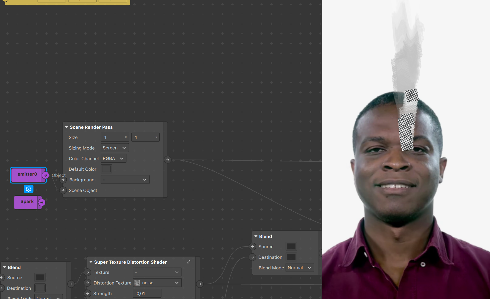

### Conclusion

Maintenant que nous avons notre Super Texture Distortion Shader tm et que vous savez faire de la fumée avec, voici quelques voies à explorer :
- Animer la texture bruit (noise) afin de rendre la fumée plus fluide!
- Appliquez-le à des séquences d'animations, notamment du feu!
- Essayez de créer un effet de verre avec le patch de distortion
- Fumée + un peu de distortion en arrière plan pour simuler une vague de chaleur?